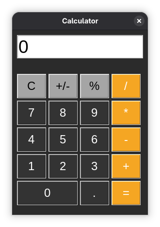
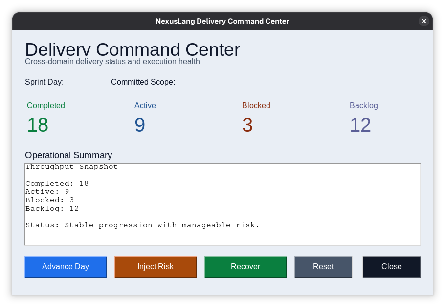
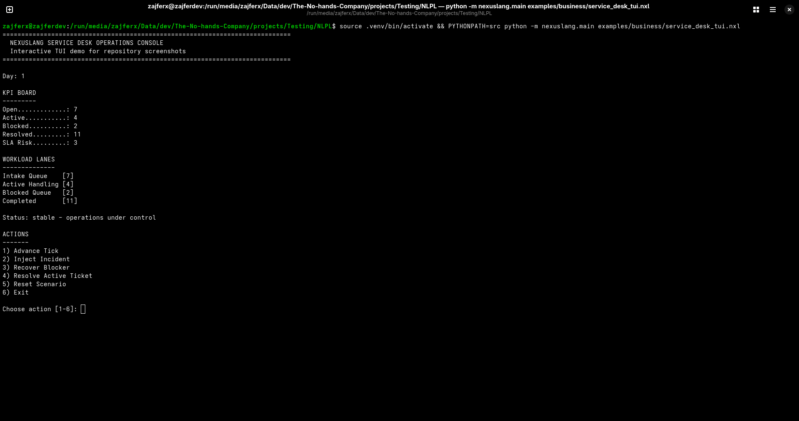

# NexusLang

> A general-purpose programming language with English-like syntax and native backend support.

[](https://github.com/The-No-Hands-company/Nexuslang/actions/workflows/ci.yml)
[](https://www.python.org/downloads/)
[](LICENSE)

NexusLang (NLPL syntax) is designed to keep code readable while supporting low-level control, native compilation paths, and production tooling.

## 60-Second Start

```bash
git clone https://github.com/The-No-Hands-company/Nexuslang
cd Nexuslang
pip install -r requirements.txt

# Run a program
PYTHONPATH=src python -m nexuslang.main examples/01_basics/01_basic_concepts.nlpl

# Run tests
PYTHONPATH=src python -m pytest tests/
```

For full setup and workflow details, see [QUICKSTART.md](QUICKSTART.md).

## Showcase

### Desktop Calculator (GUI)

This calculator demo is implemented in NexusLang and executed through the current interpreter/runtime GUI layer.



Run it locally:

```bash
PYTHONPATH=src python -m nexuslang.main examples/26_calculator_gui.nxl
```

### Delivery Command Center (GUI)

Business-oriented KPI dashboard built with the NexusLang GUI runtime.



Run it locally:

```bash
PYTHONPATH=src python -m nexuslang.main examples/27_delivery_dashboard_gui.nxl
```

### Service Desk Operations (Interactive TUI)

Interactive terminal application with stateful updates and action-driven workflow.



Run it locally:

```bash
PYTHONPATH=src python -m nexuslang.main examples/business/service_desk_tui.nxl
```

## Language At A Glance

```nlpl
# Variables
set name to "Alice"
set score as Float to 98.6

# Functions
function add with a as Integer, b as Integer returns Integer
    return a plus b
end

# Control flow
if score is greater than 90
    print text "Excellent"
else
    print text "Keep going"
end

# Pattern matching
match score
    case _ if score is greater than or equal to 90
        print text "A"
    case _
        print text "Non-A"
end
```

## Capability Summary

NexusLang is intended for broad, general-purpose development across domains.

- Business and enterprise applications
- Data processing and analytics pipelines
- Scientific and numerical workloads
- Web and network services
- Systems and low-level utilities
- Embedded-style and resource-constrained targets (ongoing)
- Desktop tooling and developer automation

Current implementation includes:

- Lexer, parser, AST, interpreter pipeline
- Optional type checking and type inference
- LLVM IR backend and native toolchain integration
- C backend
- Module system and FFI support
- Standard library modules across core domains
- LSP server and debugger support

## Tooling

### Command-line workflow

```bash
# Run a source file
PYTHONPATH=src python -m nexuslang.main path/to/program.nlpl

# Build / run project workflows
PYTHONPATH=src python -m nexuslang.cli build
PYTHONPATH=src python -m nexuslang.cli run

# Start language server (stdio)
PYTHONPATH=src python -m nexuslang.lsp --stdio
```

### Editor support

- VS Code extension: [vscode-extension](vscode-extension)
- Neovim config: [editors/neovim](editors/neovim)
- Emacs mode: [editors/emacs](editors/emacs)
- Sublime syntax: [editors/sublime-text](editors/sublime-text)

## Architecture

```text
Source -> Lexer -> Parser -> AST -> Optimizer -> Interpreter
                                          -> LLVM IR Generator -> llc/clang -> Native Binary
```

Core paths:

- [src/nexuslang/parser/lexer.py](src/nexuslang/parser/lexer.py)
- [src/nexuslang/parser/parser.py](src/nexuslang/parser/parser.py)
- [src/nexuslang/parser/ast.py](src/nexuslang/parser/ast.py)
- [src/nexuslang/interpreter/interpreter.py](src/nexuslang/interpreter/interpreter.py)
- [src/nexuslang/typesystem](src/nexuslang/typesystem)
- [src/nexuslang/compiler/backends/llvm_ir_generator.py](src/nexuslang/compiler/backends/llvm_ir_generator.py)
- [src/nexuslang/compiler/backends/c_generator.py](src/nexuslang/compiler/backends/c_generator.py)
- [src/nexuslang/lsp](src/nexuslang/lsp)
- [src/nexuslang/stdlib](src/nexuslang/stdlib)
- [tests](tests)

## Project Status

NexusLang is pre-v1.0 and under active development.

Strong areas today:

- Core language pipeline and interpreter
- Broad standard library surface
- Compiler backend progress (C and LLVM paths)
- Tooling stack (LSP, debugger, build workflows)
- Extensive automated test coverage

Active focus areas:

- Closing remaining backend edge-case gaps
- Continued semantic hardening and performance work
- Expanded showcase applications demonstrating end-to-end build and runtime capabilities

## Documentation Map

- Getting started: [docs/getting-started](docs/getting-started)
- Programming guide: [docs/guide](docs/guide)
- Language and stdlib reference: [docs/reference](docs/reference)
- Tooling docs: [docs/tooling](docs/tooling)
- Internal planning and status: [docs/_internal](docs/_internal)

## Contributing

See [CONTRIBUTING.md](CONTRIBUTING.md).

Common validation command:

```bash
PYTHONPATH=src python -m pytest tests/
```

## License

MIT. See [LICENSE](LICENSE).
